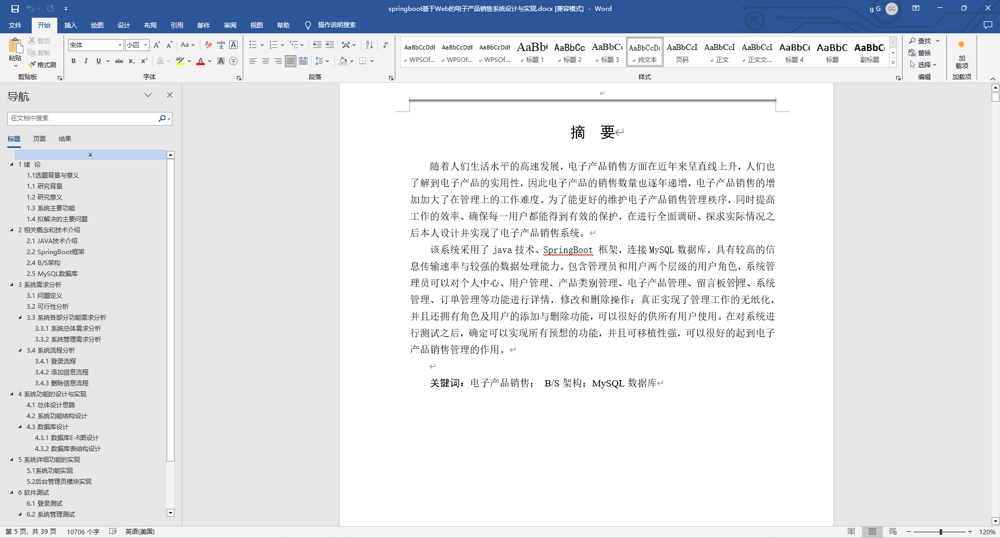
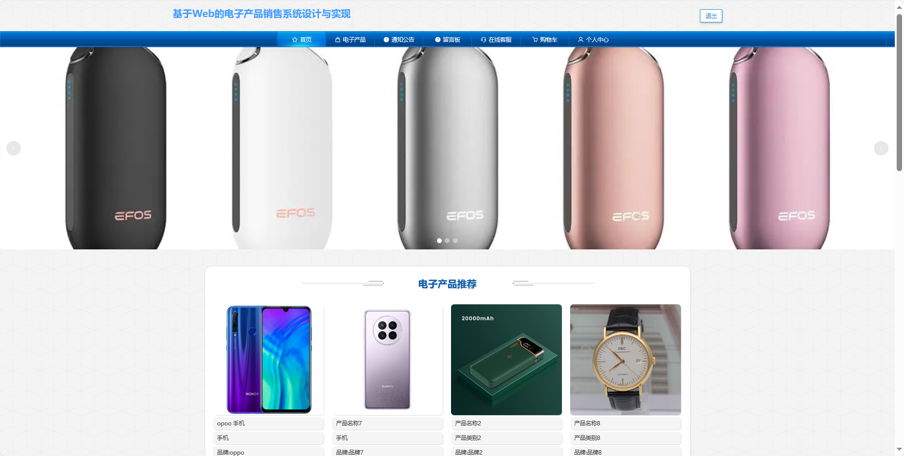
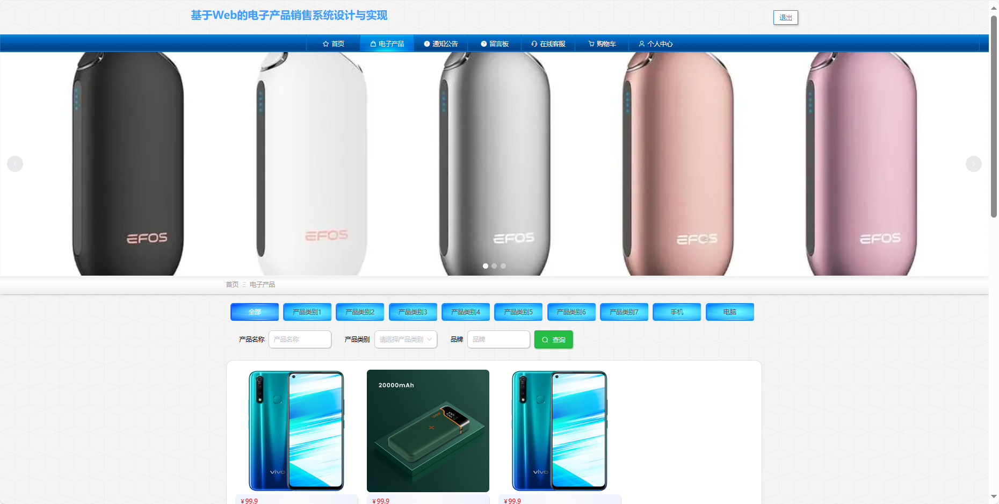
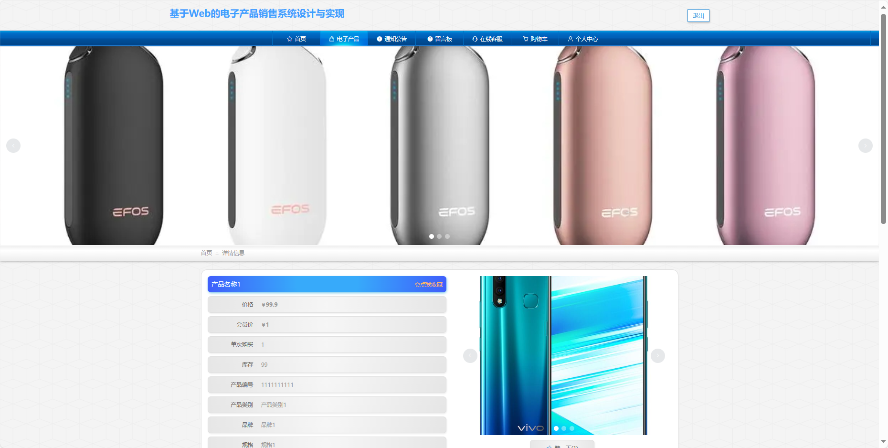
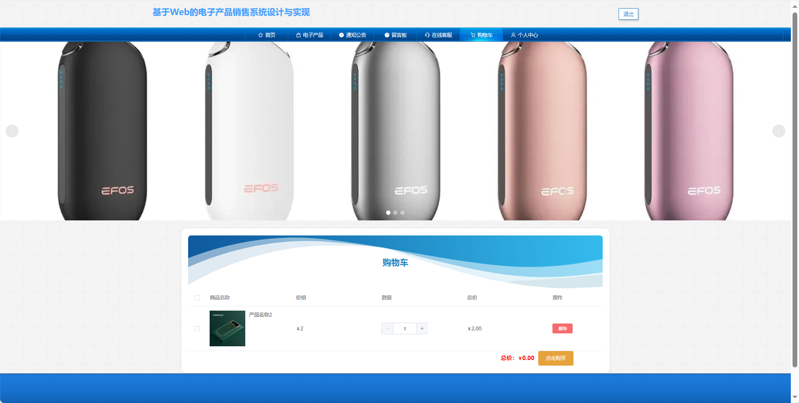
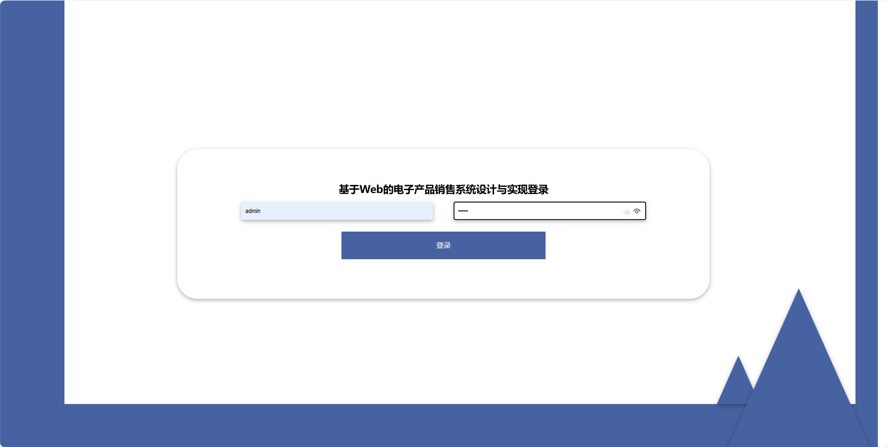
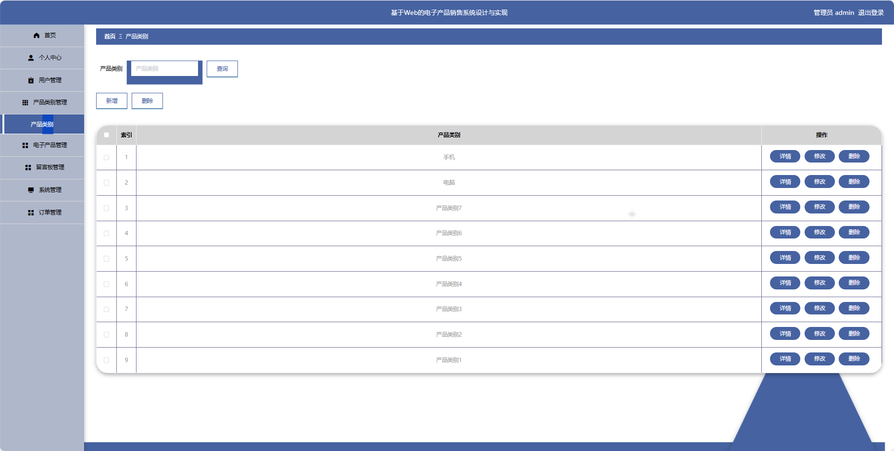
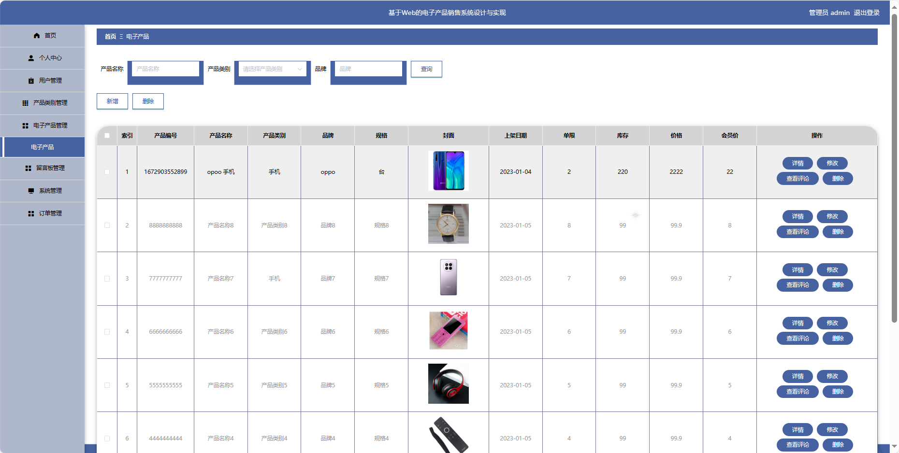
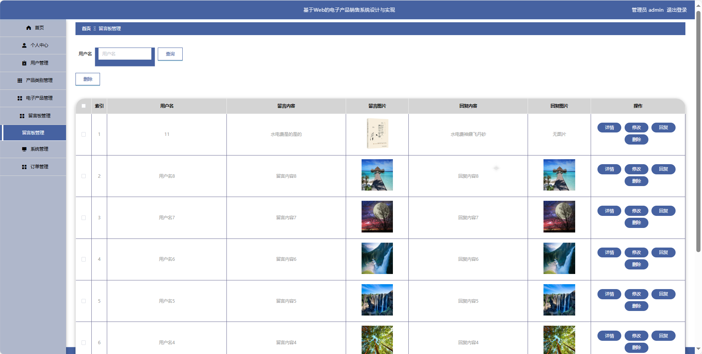

## 基于SpringBoot的电子产品销售系统(程序+报告)

###  获取sql数据库文件: 从戎源码网 (https://armycodes.com/) QQ: 386869957 QQ群: 377586148
###  所有系统地址: (https://github.com/YuLin-Coder/AllProjectCatalog) 
###  所有项目以及源代码本人均调试运行无问题 可支持远程安装部署调试、定制修改、代码讲解

## 项目介绍
基于SpringBoot的电子产品销售系统，系统包含两种角色：管理员、用户主要功能如下。

### 【管理员】:
首页：查看系统整体概况和关键数据。
个人中心：管理个人信息。
用户管理：审核和管理注册用户的信息。
产品类别管理：管理电子产品的分类信息。
电子产品管理：监管和管理系统中的电子产品信息。
留言板管理：查看和管理用户在留言板上的留言，进行必要的处理。
系统管理：管理系统的基本设置和运行参数。
订单管理：查看和处理用户购买电子产品的订单。

### 【用户】:
首页：浏览系统的主要信息和最新推荐。
电子产品：查看系统中各类电子产品。
通知公告：阅读系统发布的相关通知和公告。
留言板：留下对电子产品或系统的留言和反馈。
在线客服：与系统提供的在线客服进行实时交流。
购物车：管理已选购电子产品，包括添加、删除和结算功能。
个人中心：管理个人信息、查看订单记录和收货地址等。

## 项目技术
- 编程语言：Java
- 数据库：MySQL
- 项目管理工具：Maven
- 前端技术：HTML、CSS、JavaScript、Jquery、Vue
- 后端技术：Spring、SpringMVC、MyBatis

## 运行环境
- JDK版本：JDK1.8及以上
- 开发工具：IDEA、Ecplise、Myecplise都可以
- 数据库: MySQL5.7及以上
- Maven：maven3.0及以上
- Node：14.14.0及以上

## 运行截图

